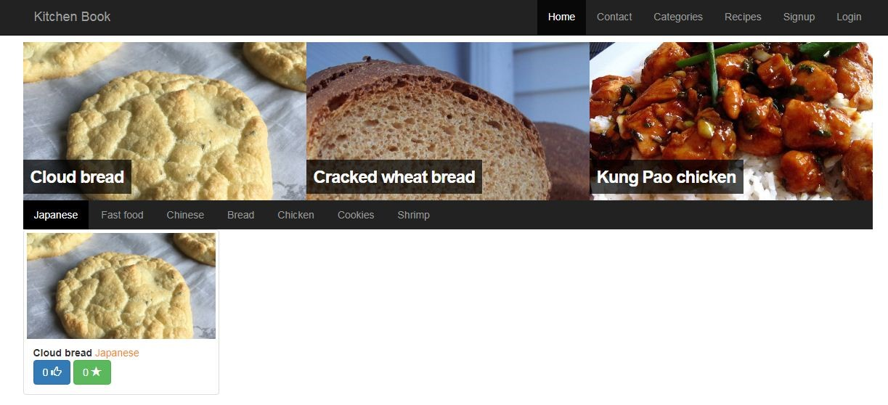
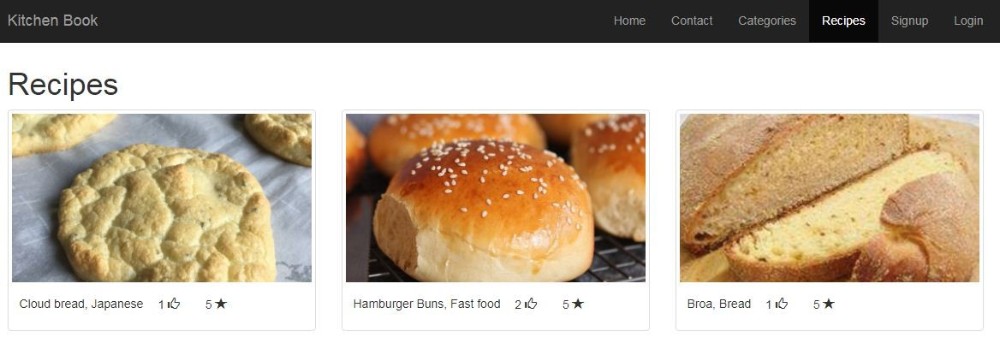
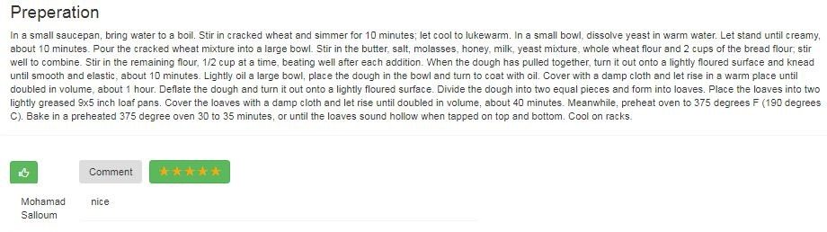
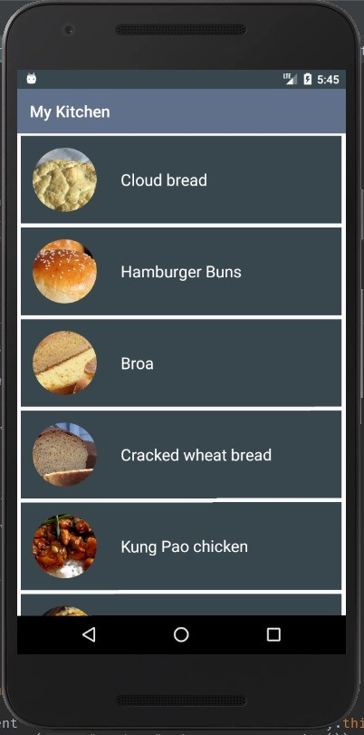
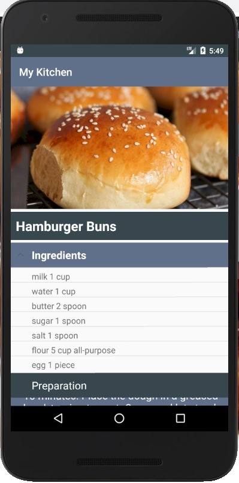
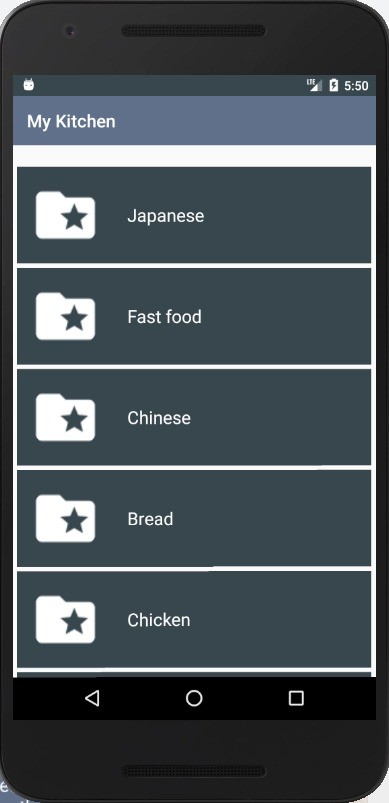

# 🍲 KitchenBook – Web & Mobile Application

### 🎓 University Project II (PR2) – Fifth Year (January 2019)

KitchenBook is an integrated food recipe platform consisting of a **web application** and a **mobile app**, developed as part of a university graduation project.

---

## 🔧 Tech Stack

- 🖥️ **Web App**:  
  - **Frontend**: HTML5, CSS3, Bootstrap 4  
  - **Backend**: PHP, MySQL

- 📱 **Mobile App**:  
  - Java, XML  
  - JSON for data exchange with backend

---

## 🌟 Key Features

- Multi-level **role-based access control**
- Sidebar advertisements for monetization
- Detailed analytics for recipe popularity:
  - Ratings, likes, shares, comments
- Seamless **data synchronization** between web and mobile versions for a unified user experience

---

## 📸 Screenshots

### 🖥️ Web Version

| 🏠 Home Page                  | 📖 Recipe View                  | ⭐ Recipe Rating              |
|  |  |  |

| 🏠 Home Screen                   | 📖 Recipe Details                  | 📂 Categories List                    |
|  |  |  |

---

### 📱 Mobile Version

| Home Screen | Recipe Details | User Profile |
|-------------|----------------|--------------|
|  |  |  |

---

## 📁 Repository

🔗 [KitchenBook — GitHub Repository](https://github.com/mohammed-salloum/KitchenBook)
---

📌 Notes
This project was developed as part of the graduation requirements at the Faculty of Informatics Engineering, aiming to simulate real-world e-commerce platforms for vehicles.
