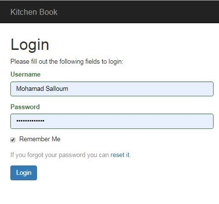
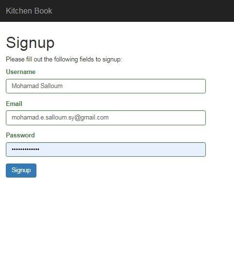
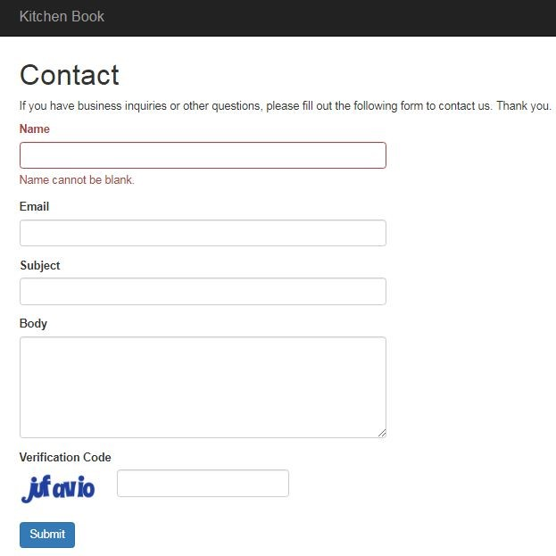

# 🍲 KitchenBook – Web & Mobile Application

### 🎓 University Project II (PR2) – Fifth Year (January 2019)

KitchenBook is an integrated food recipe platform consisting of a **web application** and a **mobile app**, developed as part of a university graduation project.

---

## 🔧 Tech Stack

- 🖥️ **Web App**:  
  - **Frontend**: HTML5, CSS3, Bootstrap 4  
  - **Backend**: PHP, MySQL

- 📱 **Mobile App**:  
  - Java, XML  
  - JSON for data exchange with backend

---

## 🌟 Key Features

- Multi-level **role-based access control**
- Sidebar advertisements for monetization
- Detailed analytics for recipe popularity:
  - Ratings, likes, shares, comments
- Seamless **data synchronization** between web and mobile versions for a unified user experience

---

## 📸 Screenshots

### 🖥️ Web Version

#### 🏠 Home Page

#### 📖 Recipe View

#### ⭐ Recipe Rating

#### 🔐 Login Page

#### 📝 Signup Page

#### 📬 Contact Page

---

### 📱 Mobile Version

#### 🏠 Home Screen

#### 📖 Recipe Details

#### 📂 Categories List

---

## 📁 Repository

🔗 [KitchenBook — GitHub Repository](https://github.com/mohammed-salloum/KitchenBook)
---

📌 Notes

This project was developed as a graduation project at the Faculty of Informatics Engineering. It simulates a real-world, cross-platform recipe management system tailored for cooking enthusiasts and food content creators.

---

## 👨‍💻 Author

**Mohammed Salloum**  
Full-Stack Developer | Django & Front-End Specialist  
📧 mohammed.e.salloum@gmail.com  
🔗 [LinkedIn – mohammed-salloum-dev](https://linkedin.com/in/mohammed-salloum-dev)
