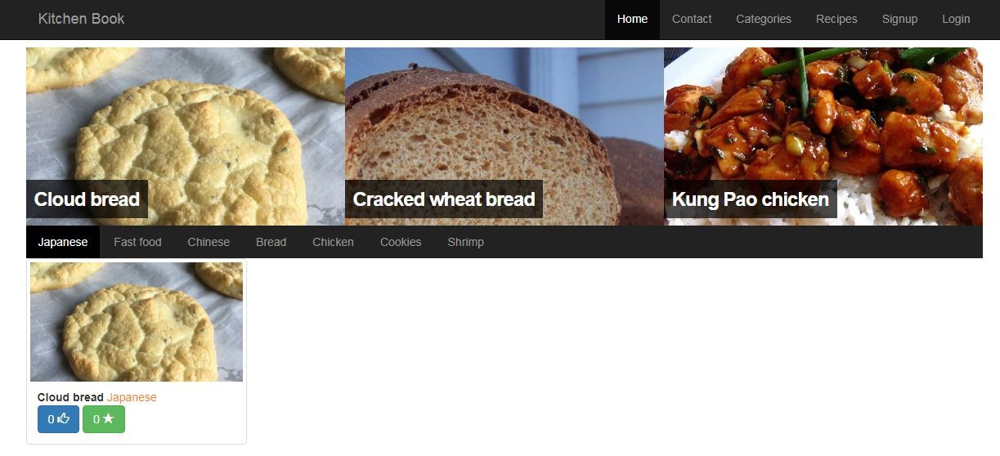
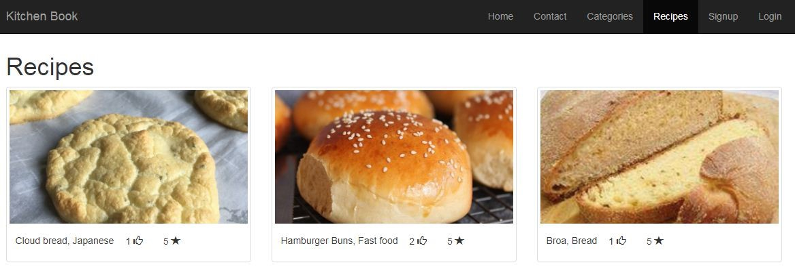
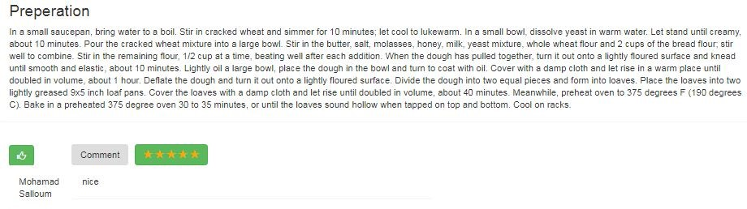
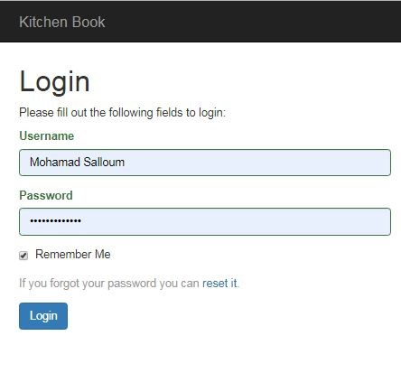
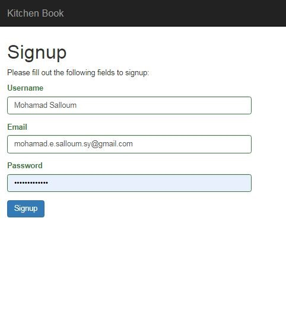
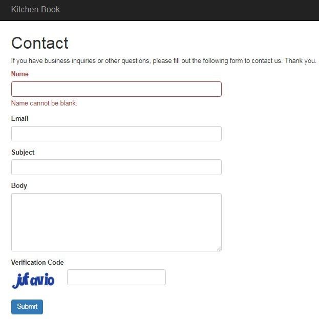
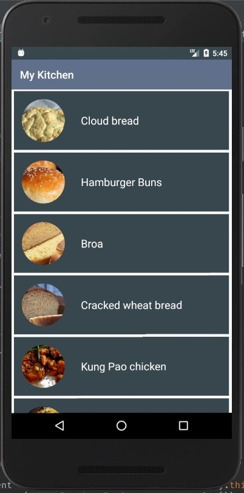
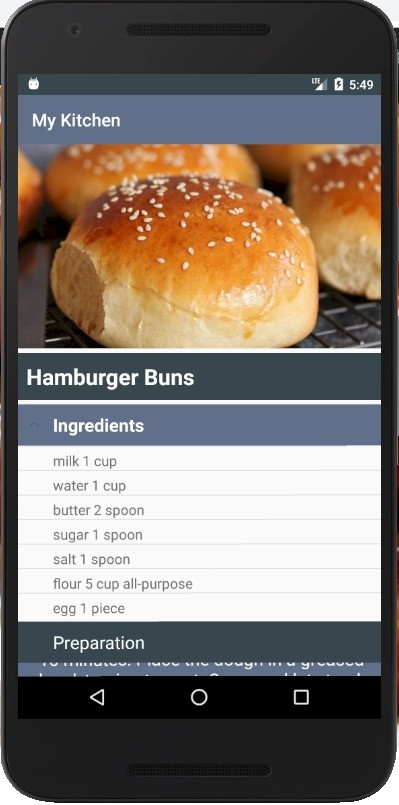
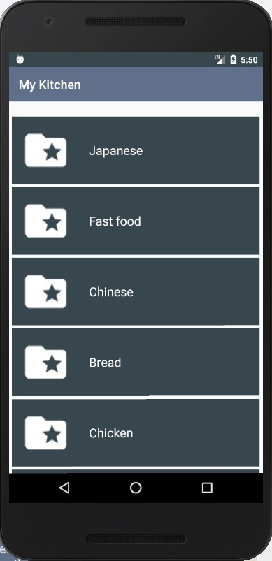

# 🍲 Kitchen Book & My Kitchen – Web & Mobile Application

### 🎓 University Project II (PR2) | January 2019

KitchenBook is an integrated food recipe platform consisting of a **web application** and a **mobile app**, developed as part of a university graduation project. The system offers seamless recipe management with cross-platform synchronization.

---

## 🔧 Tech Stack

- 🖥️ **Web App** :  
  - **Frontend** : HTML5, CSS3, Bootstrap 4  
  - **Backend** : PHP, MySQL

- 📱 **Mobile App** :  
  - Java, XML  
  - JSON for data exchange with backend

---

## 🌟 Key Features

- Multi-level **role-based access control**  
- Sidebar advertisements for monetization  
- Detailed analytics for recipe popularity: ratings, likes, shares, comments  
- Seamless **data synchronization** between web and mobile for a unified user experience  

---

## 📸 Screenshots

### 🖥️ Web Version

#### 🏠 Home Page  

#### 📖 Recipe View  

#### ⭐ Recipe Rating  

#### 🔐 Login Page  

#### 📝 Signup Page  

#### 📬 Contact Page  

---

### 📱 Mobile Version

#### 🏠 Home Screen  

#### 📖 Recipe Details  

#### 📂 Categories List  

---

## 📁 Repository

Full source code and project files available here:
[🔗 KitchenBook — GitHub Repository](https://github.com/mohammed-salloum/KitchenBook)

---

## 👨‍💻 Author

**Mohammed Salloum**  
Full-Stack Web Developer | Django & React Specialist  
📧 mohammed.e.salloum@gmail.com  
🔗 [LinkedIn – mohammed-salloum-dev](https://linkedin.com/in/mohammed-salloum-dev)
